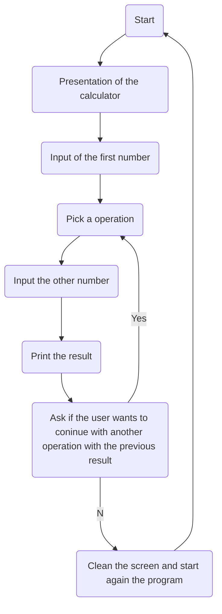

# Functions with Outputs

For the [example](example.py) file you will find a function called "days_in_month_by_year" tha prints the number of days in a selected month depending if the year is a leap year or not.

For the [main](main.py) file, i make a program that simulates a calculator.

It was created following the next structure.

