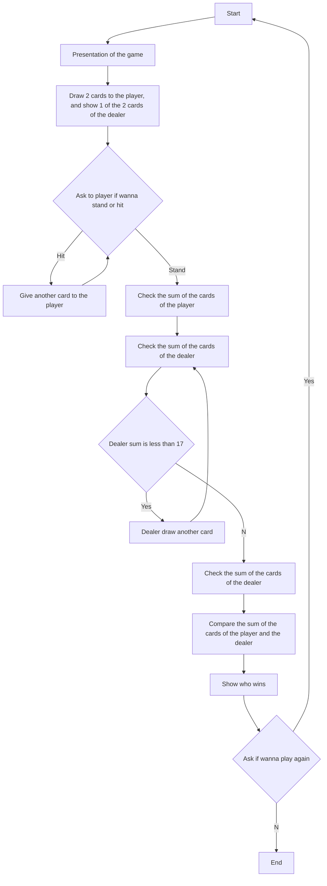

# The Blackjack Capstone Project

The [main](main.py) file is a simple blackjack game. To create this project, I used the following structure:

```mermaid
graph TD;
A[Start]-->B[Presentation of the game];
B-->C[Draw 2 cards to the player, and show 1 of the 2 cards of the dealer];
C-->D{Ask to player if wanna stand or hit};
D--Hit-->E[Give another card to the player];
E-->D
D--Stand-->F[Check the sum of the cards of the player];
F-->G[Check the sum of the cards of the dealer];
G-->H{Dealer sum is less than 17};
H--Yes-->I[Dealer draw another card];
I-->G
H--No-->J[Check the sum of the cards of the dealer];
J-->K[Compare the sum of the cards of the player and the dealer];
K-->L[Show who wins];
L-->M{Ask if wanna play again};
M--Yes-->A
M--No-->End
```