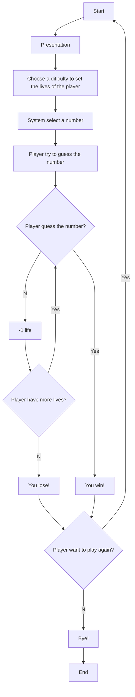

# Scope & Number Guessing Game

```mermaid
graph TD;
A[Start]-->B[Presentation]-->C[Choose a dificulty to set the lives of the player];
C-->D[System select a number];
D-->E[Player try to guess the number];
E-->F{Player guess the number?};
F--Yes-->G[You win!];
F--No-->H[-1 life];
H-->I{Player have more lives?};
I--Yes-->F;
I--No-->J[You lose!];
J-->K{Player want to play again?};
K--Yes-->A;
G-->K;
K--No-->L[Bye!];
L-->M[End];
```