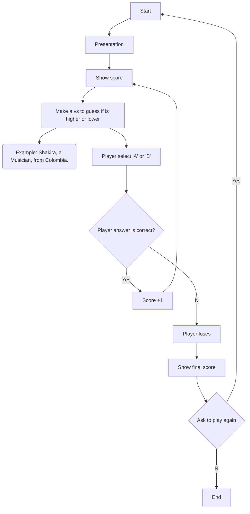

# Higher or Lower Game Project

This project is a simple game, where the player has to guess who have the higher number of followers between two artists.

```mermaid
graph TD;
A[Start]-->B[Presentation];
B-->C[Show score];
C-->D[Make a vs to guess if is higher or lower] --> L(Example: Shakira, a Musician, from Colombia.);
D-->E[Player select 'A' or 'B'];
E-->F{Player answer is correct?};
F--Yes-->G[Score +1];
G-->C;
F--No-->H[Player loses];
H-->I[Show final score];
I-->J{Ask to play again};
J--Yes-->A;
J--No-->K[End];
```