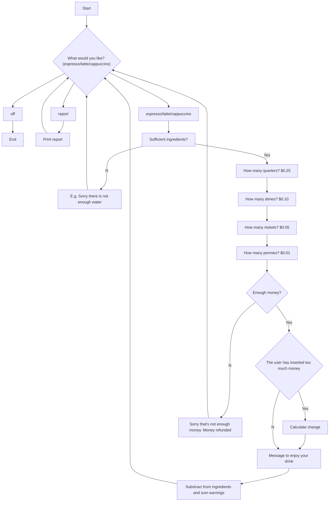

# Coffe Machine Program

```mermaid
graph TD;
A[Start]-->C{"What would you like? (espresso/latte/cappuccino)"};
C-->O[off];
O-->P[End];
C-->D[report];
D-->H[Print report];
H-->C;
C-->E[espresso/latte/cappuccino];
E-->Q[Sufficient ingredients?];
Q--Yes-->F[How many quarters? $0.25];
Q--No-->Z[E.g. Sorry there is not enough water];
Z-->C;
F-->G[How many dimes? $0.10];
G-->I[How many nickels? $0.05];	
I-->J[How many pennies? $0.01];
J-->K{Enough money?};
K--Yes-->W{The user has inserted too much money};
W--Yes-->Y[Calculate change];
Y-->B;
W--No-->B[Message to enjoy your drink];
B-->N[Substract from ingredients and sum earnings];
N-->C;
K--No-->M[Sorry that's not enough money. Money refunded];
M-->C;
```