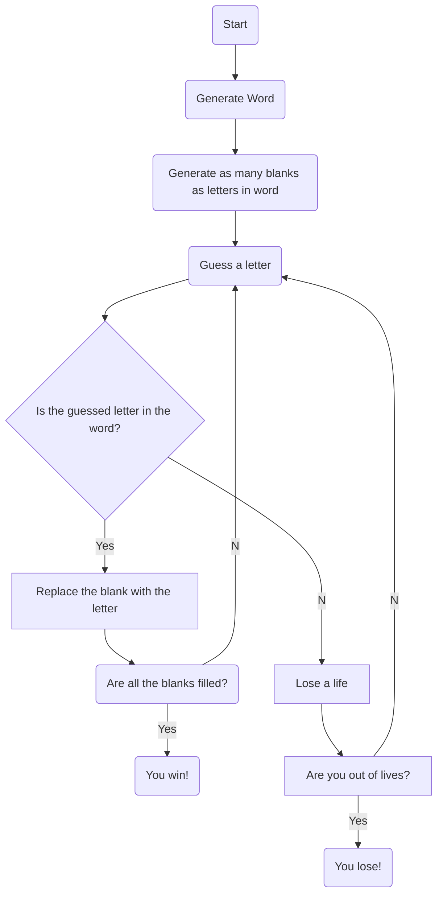

# Hangman Game

```mermaid
graph TD
A(Start) --> B(Generate Word)
B --> C(Generate as many blanks as letters in word)
C --> D(Guess a letter)
D --> E{Is the guessed letter in the word?}
E --Yes--> F[Replace the blank with the letter]
E --No--> G[Lose a life]
F --> H(Are all the blanks filled?)
H --No--> D
H --Yes--> K(You win!)
G-->J[Are you out of lives?]
J --Yes--> I(You lose!)
J --No--> D
```

